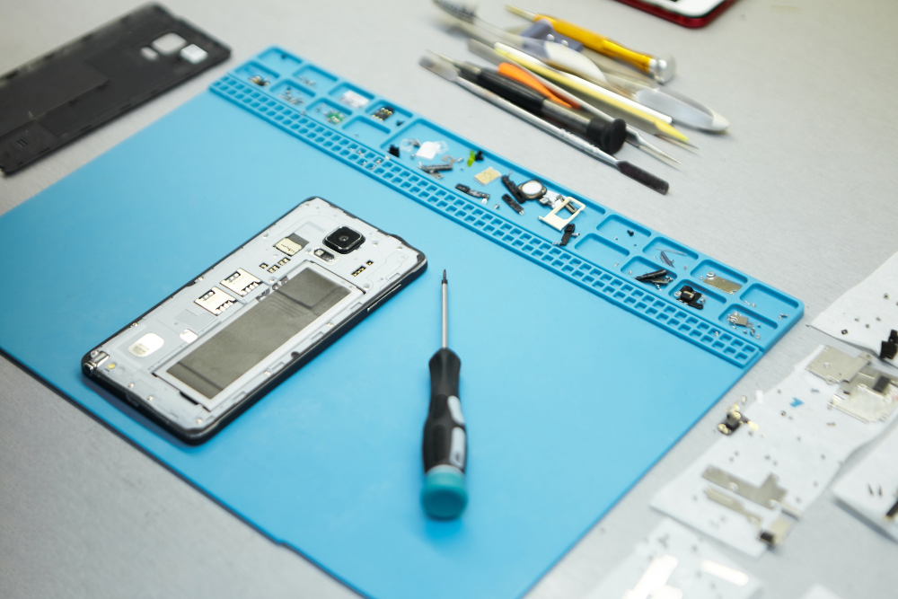

# Battery Replacement

Is your iPhone or Android battery draining fast, not charging, or turning off unexpectedly?  
Get a fresh battery installed quickly and professionally!

---

## Why Replace Your Battery?

- Old batteries lose capacity, causing short life and random shutdowns
- Swollen batteries are a safety risk
- A healthy battery means reliable performance and longer device life

---

## Signs You Need a New Battery

- Battery percentage drops rapidly
- Phone shuts down with charge remaining
- Slow charging or won't charge at all
- Device feels hot or battery is swollen

---

**Supported:**  
All iPhone and Android models

---

## Our Battery Replacement Process

---

**1. Free Assessment**

- Test battery health and charging function
- Check for other issues

---

**2. Upfront Quote**

- Clear, fixed price
- No hidden fees

---

**3. Professional Replacement**

- Carefully open device and swap battery
- Use only high-quality or OEM batteries
- Dispose of old battery safely

---

**4. Full Testing**

- Confirm healthy charging and battery life
- Check all device functions

---

**5. Fast Service & Warranty**

- Most jobs done same or next day
- 90-day warranty on new battery

---

## Why Choose Fast Repair?

- **Expert technicians:** iPhone & Android battery specialists
- **Quality batteries:** Safe, long-lasting, and reliable
- **Transparent pricing:** No surprises
- **Warranty:** 90 days for peace of mind

---

**Stop living with a dying phone—get your battery replaced today!**

---

## Contact Us

**Phone:** +60 189621486  
**Email:** crepair276@gmail.com  
**Location:** 1st Floor, Lot No 1-001G, Plaza Low Yat, 7, Jalan Bintang, Bukit Bintang, 55100 Kuala Lumpur

_Express service available for urgent needs._
