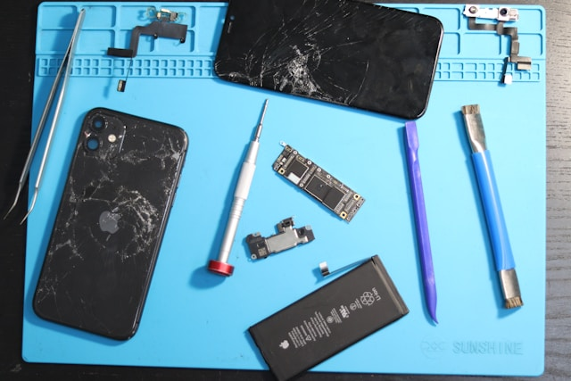

# Body/Frame Changing

Is your phone’s body or frame dented, bent, or badly scratched?  
We professionally swap your iPhone or Android’s housing for a fresh, flawless look.

---

## Why Change Your Phone’s Body?

- Dented or bent frames affect durability and water resistance
- Deep scratches, scuffs, or chips spoil your device’s look
- New housing restores resale value and structural integrity

---

## What We Replace

- Full outer frame (housing)
- Rear cover (if metal or plastic)
- Side buttons and SIM tray (if needed)

---

**Supported:**  
All iPhone and Android models

---

## Our Frame/Body Replacement Process

---

**1. Full Inspection**

- Assess damage to frame, screen, and internal parts
- Advise if screen or internal parts also require replacement

---

**2. Upfront Quote**

- Clear, fixed price for parts and labor
- No hidden fees

---

**3. Precise Disassembly**

- Expertly transfer all components (screen, logic board, cameras, etc.) to new housing
- Use only quality replacement frames
- Keep all functions (Face ID, fingerprint, etc.) intact

---

**4. Full Testing**

- Check screen, buttons, speakers, cameras, and charging
- Ensure device looks and works like new

---

**5. Fast Turnaround & Warranty**

- Most jobs done in 1–2 days
- 90-day warranty on all parts/labor

---

## Why Fast Repair?

- **Skilled technicians:** Experienced in complex body/frame swaps
- **Quality frames:** Strong, precise, and good-looking
- **Transparent pricing:** No surprises
- **Warranty:** 90 days for peace of mind

---

**Give your phone a new lease on life—get a fresh body today!**

---

## Contact Us

**Phone:** +60 189621486  
**Email:** crepair276@gmail.com  
**Location:** 1st Floor, Lot No 1-001G, Plaza Low Yat, 7, Jalan Bintang, Bukit Bintang, 55100 Kuala Lumpur

_Express service available for urgent needs._
