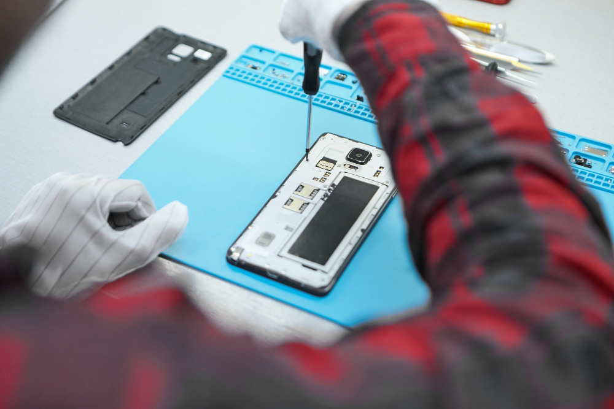

# Camera Issues

Is your iPhone or Android camera not working, blurry, or showing errors?  
We restore your main and selfie cameras to perfect working condition—fast.

---

## Why Fix Camera Problems?

- Missed memories: No photos or videos when you need them
- Blurry or dark images ruin quality
- Camera errors can signal deeper hardware faults

---

## Common Camera Issues We Fix

- Camera won’t open or shows black screen
- Blurry, out-of-focus, or dark photos
- Error messages like “Camera Failed” or “Cannot Connect”
- Flash not working
- Selfie or rear camera not switching
- Lens cracked or dirty

---

**Supported:**  
All iPhone and Android models

---

## Our Camera Repair Process

---

**1. Full Inspection**

- Test camera app, lens, flash, and related components
- Check for software glitches or hardware faults

---

**2. Upfront Quote**

- Transparent, fixed price for parts and labor
- No hidden costs

---

**3. Professional Repair**

- Clean, adjust, or replace camera modules
- Fix lens, flash, or connector issues
- Use only quality or OEM camera parts

---

**4. Full Testing**

- Verify sharp, clear photos and video
- Check focus, flash, and switching functions

---

**5. Fast Turnaround & Warranty**

- Most repairs done same or next day
- 90-day warranty on all parts/labor

---

## Why Fast Repair?

- **Expert technicians:** Camera specialists for iPhone & Android
- **Quality parts:** For reliable, high-quality photos
- **Transparent pricing:** No surprises
- **Warranty:** 90 days for peace of mind

---

**Don’t miss another shot—restore your camera today!**

---

## Contact Us

**Phone:** +60 189621486  
**Email:** crepair276@gmail.com  
**Location:** 1st Floor, Lot No 1-001G, Plaza Low Yat, 7, Jalan Bintang, Bukit Bintang, 55100 Kuala Lumpur

_Express service available for urgent needs._
