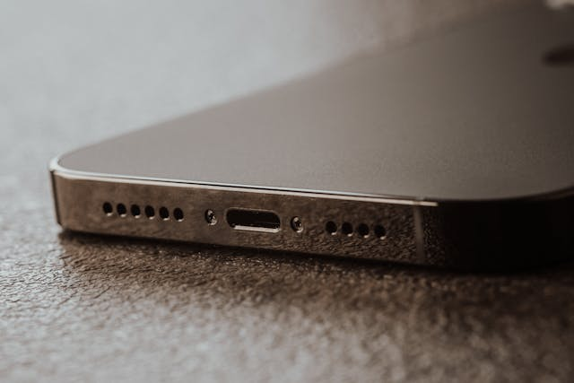

# Charging Issues Repair

Is your iPhone or Android not charging, charging slowly, or losing power fast?  
We solve charging problems quickly—so you stay powered up.

---

## Why Charging Problems Need Attention

- A faulty charging port or battery can leave you stranded
- Slow charging or “accessory not supported” warnings can signal deeper issues
- Ignoring charging issues may cause further damage or data loss

---

## Common Charging Issues We Fix

- Phone won’t charge or only charges at certain angles
- Charging is slow or intermittent
- Battery drains too quickly
- “Accessory not supported” or similar error
- Wireless charging not working

---

**Supported:**  
All iPhone and Android models

---

## Our Charging Repair Process

---

**1. Diagnosis**

- Inspect charging port, cable, and battery
- Test with known-good parts
- Check for software and hardware faults

---

**2. Transparent Quote**

- Clear, upfront pricing
- No hidden fees

---

**3. Professional Repair**

- Clean or replace charging port
- Battery replacement if needed
- Repair/replace charging IC or wireless modules
- Only quality parts used

---

**4. Full Testing**

- Confirm fast, stable charging
- Verify all phone functions

---

**5. Fast Service & Warranty**

- Most repairs done same or next day
- 90-day warranty on all parts/labor

---

## Why Choose Fast Repair?

- **Expert technicians:** Charging & battery specialists
- **Quality parts:** Reliable, safe, and long-lasting
- **Transparent pricing:** No surprises
- **Warranty:** 90 days for peace of mind

---

**Don’t get stuck with a dead phone—fix your charging issues today!**

---

## Contact Us

**Phone:** +60 189621486  
**Email:** crepair276@gmail.com  
**Location:** 1st Floor, Lot No 1-001G, Plaza Low Yat, 7, Jalan Bintang, Bukit Bintang, 55100 Kuala Lumpur

_Express service available for urgent needs._
