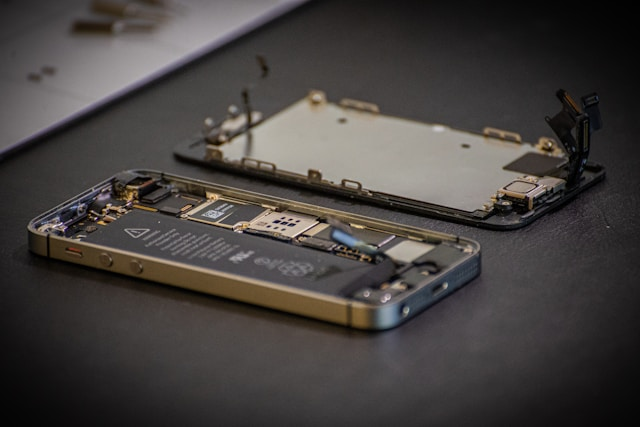

# iPhone & Android Motherboard Repair

Is your phone completely dead, stuck in a boot loop, or showing strange glitches?  
Motherboard issues often cause these serious problems—and we’re here to help!

---

## Why Motherboard Repair Matters

- The motherboard is your phone’s “brain”—most critical part
- Problems can mean no power, random shutdowns, charging failures, or lost data
- Skilled repair can save your device and your valuable information

---

## Common Motherboard Problems We Fix

- Phone doesn’t turn on or stuck on logo
- Not charging, or battery drains instantly
- No sound, camera, WiFi, or network issues
- Overheating or randomly restarting
- Data not accessible

---

**Supported Models:**  
All iPhone models  
All Android brands (Samsung, Xiaomi, Oppo, Vivo, Huawei, etc.)

---

## Our Motherboard Repair Process

---

**1. Expert Diagnosis**

- Full device assessment
- Pinpoint the root cause (hardware or chip-level)

---

**2. Transparent Quote**

- Clear, upfront pricing
- No hidden costs

---

**3. Precision Repair**

- Advanced microsoldering and chip replacement
- Repair or replace faulty power, charging, audio, or IC chips
- Only quality components used

---

**4. Testing & Data Integrity**

- Check all phone features and data access
- Do our best to save your photos and info

---

**5. Fast Handover & Warranty**

- Most repairs done in 2–5 days
- 90-day warranty on all parts and labor

---

## Why Fast Repair?

- **Highly skilled technicians:** Years of chip-level experience
- **State-of-the-art tools:** For accurate, safe repairs
- **Honest pricing:** No surprises
- **Data care:** Your privacy and info are top priority
- **Warranty:** 90 days for peace of mind

---

**Don’t give up on your phone!  
We bring dead devices back to life.**

---

## Contact Us

**Phone:** +60 189621486  
**Email:** crepair276@gmail.com  
**Location:** 1st Floor, Lot No 1-001G, Plaza Low Yat, 7, Jalan Bintang, Bukit Bintang, 55100 Kuala Lumpur

_Express service available for urgent cases._
