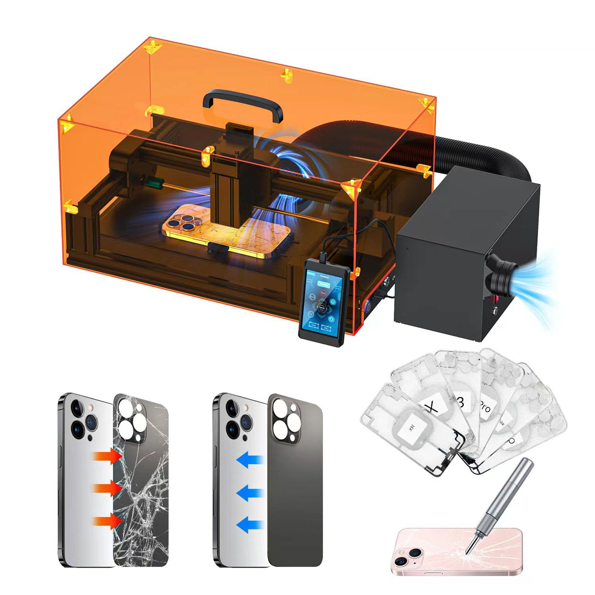

# iPhone & Samsung Back Glass Repair

Cracked or shattered back glass on your iPhone or Samsung?  
We restore your device’s look and integrity—fast and professionally.

---

## Why Repair Back Glass?

A broken back panel isn't just about looks:

- Can expose internal parts to dust, moisture, and debris
- May affect wireless charging or camera performance
- Sharp fragments can cause injury
- Reduces your phone’s resale value

---

## What We Fix

**Common Back Glass Issues:**

- Cracked, chipped, or shattered rear panels
- Loose or missing glass pieces
- Compromised wireless charging (if applicable)

**Modern Back Panel Facts:**  
Back glass is often fused or strongly adhered to the phone for strength and wireless charging.  
Removing and replacing it requires special tools and care.

---

**Supported Models:**

- iPhones (8 and newer, including all Pro/Pro Max models)
- Samsung Galaxy (S, Note, A, Z Fold/Flip series)

---

## Our Back Glass Replacement Process

---

**1. Inspection & Testing**

- Check the extent of damage
- Test wireless charging, camera, and all functions

---

**2. Clear, Upfront Quote**

- Price based on model and condition
- No hidden fees

---

**3. Precision Removal**

- Device gently heated to soften adhesives
- Special tools (including laser machines for some models) used to remove shattered glass
- Internal components and charging coil protected

---

**4. Clean & Replace**

- Residue and debris safely cleared
- High-quality back glass panel fitted
- Strong adhesive applied for durability and water resistance

---

**5. Final Testing & Handover**

- All features checked: charging, camera, buttons
- Device returned—typically in 24-48 hours
- 90-day warranty on parts & labor

---

## Why Fast Repair for Back Glass?

- **Skilled technicians:** iPhone/Samsung back glass experts
- **Premium parts:** Durable, precise fit
- **Advanced tools:** For safe, flawless removal and install
- **Speed:** Most repairs completed quickly
- **Transparent pricing:** No surprises
- **Warranty:** 90 days for peace of mind

---

**Don’t risk internal damage or injury. Restore your phone’s back glass today.**

---

## Contact Us

**Phone:** +60 189621486  
**Email:** crepair276@gmail.com  
**Location:** 1st Floor, Lot No 1-001G, Plaza Low Yat, 7, Jalan Bintang, Bukit Bintang, 55100 Kuala Lumpur

_Express service available for urgent needs._
