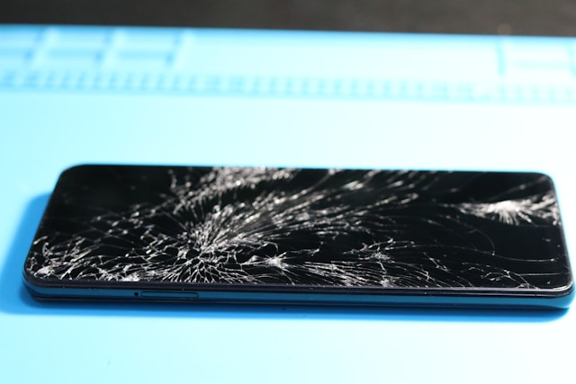

# Cracked Screen Solutions

Is your iPhone or Samsung screen cracked?  
Don’t risk further damage or injury. We restore your device’s display and touch—fast.

---

## Why Fix Your Screen Quickly?

A damaged screen is more than cosmetic:

- Can cause touch issues, dead spots, or display lines
- May let in dust or moisture, risking internal failure
- Sharp glass edges can injure your fingers

---

## What We Repair

**Typical Issues:**

- Cracked or shattered front glass
- Unresponsive or glitchy touch
- Black spots or lines on the display

**How Modern Screens Work:**  
Most screens combine three layers:

- **Outer Glass:** Protects and gives a smooth surface
- **Digitizer:** Senses your touch
- **LCD/OLED:** Shows the image

> On most iPhones and Samsungs, these are fused—so we replace the full assembly for best results.

---

**Supported:**  
All iPhones (8, X, 11, 12, 13, 14, 15 series, Pro/Pro Max)  
All Samsung Galaxy (S, Note, A, Z Fold/Flip series)

---

## How We Work

---

**1. Check & Test**

- Visual inspection for cracks and secondary damage
- Full function test (touch, camera, display, etc.)

---

**2. Clear Quote**

- Flat, upfront price
- No hidden fees

---

**3. Professional Repair**

- Device carefully opened
- Old screen removed, new assembly fitted
- High-quality or OEM parts only

---

**4. Reassemble & Seal**

- Internal connections rechecked
- Fresh adhesive for dust/splash resistance

---

**5. Full Test & Handover**

- Touch, display, buttons, and camera checked
- Device returned — usually in 24-48 hours
- 90-day warranty on all parts & labor

---

## Why Choose Fast Repair?

- **Skilled technicians:** iPhone & Samsung experts
- **Quality parts:** Lasting repairs, no cheap knockoffs
- **Speed:** Most jobs done fast
- **Honest pricing:** No surprises
- **Warranty:** 90 days for peace of mind

---

**Don’t wait. Broken screens get worse.**

---

## Contact Us

**Phone:** +60 189621486  
**Email:** crepair276@gmail.com  
**Location:** 1st Floor, Lot No 1-001G, Plaza Low Yat, 7, Jalan Bintang, Bukit Bintang, 55100 Kuala Lumpur

_Express service available for urgent cases._
