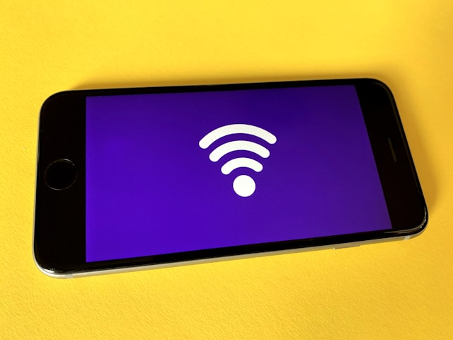

# Fast Repair — Network Issues

Struggling with calls, text, or mobile data not working on your iPhone or Android?  
We quickly diagnose and fix all network problems—so you stay connected.

---

## Why Fix Network Issues?

- Missed calls and texts can mean lost opportunities
- No data access disrupts work and daily life
- Persistent issues could signal hardware faults

---

## Common Problems We Solve

- No signal or “No Service” message
- Dropped calls or texts not sending/receiving
- Can’t connect to 4G/5G/3G data
- SIM card not detected or emergency calls only
- Signal bars present, but network still not working

---

**Supported:**  
All iPhone and Android models

---

## Our Network Repair Process

---

**1. Full Diagnosis**

- Test SIM, software settings, and network status
- Check antenna, SIM tray, and mainboard circuits

---

**2. Honest, Upfront Quote**

- Transparent pricing after diagnosis
- No hidden fees

---

**3. Professional Repair**

- Software resets or updates if needed
- Replace/repair faulty antennas, SIM readers, or chips
- Only quality parts used

---

**4. Final Testing**

- Confirm calls, SMS, and mobile data all work
- Test with your SIM on-site

---

**5. Quick Turnaround & Warranty**

- Most repairs done same or next day
- 90-day warranty on parts and labor

---

## Why Fast Repair?

- **Expert technicians:** iPhone & Android specialists
- **Advanced tools:** Diagnose and fix even tough network faults
- **Transparent pricing:** No surprises
- **Warranty:** 90 days for peace of mind

---

**Stay connected—bring your phone to Fast Repair for quick, lasting network fixes.**

---

## Contact Us

**Phone:** +60 189621486  
**Email:** crepair276@gmail.com  
**Location:** 1st Floor, Lot No 1-001G, Plaza Low Yat, 7, Jalan Bintang, Bukit Bintang, 55100 Kuala Lumpur

_Express service available for urgent cases._
