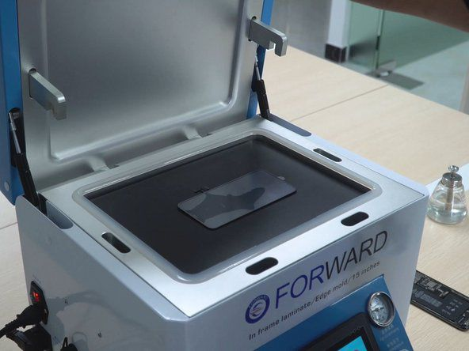

# Water Damage Repair

Did your iPhone or Samsung get wet?  
Act fast—water inside your device can cause permanent damage.

---

## Why Immediate Repair Matters

- Water corrodes internal components quickly
- Can cause short circuits, battery issues, or total device failure
- Moisture may linger even if your phone seems to work

---

## What We Handle

**Common Water Damage Issues:**

- Device won’t turn on or charges erratically
- Display flickering, spots, or lines
- Muffled speaker, microphone, or camera issues
- Overheating or random shutdowns

---

**Supported:**  
All iPhone models  
All Samsung Galaxy series

---

## Our Water Damage Rescue Process

---

**1. Immediate Assessment**

- Open device, check for moisture and corrosion
- Test all functions

---

**2. Deep Cleaning & Drying**

- Remove battery and key parts
- Use professional-grade ultrasonic cleaner and drying tools

---

**3. Component-Level Repair**

- Clean or replace affected chips, connectors, or flex cables
- Replace battery or screen if needed

---

**4. Full Testing & Quote**

- Check every function: display, touch, camera, sound, charging
- Honest, transparent pricing

---

**5. Fast Turnaround & Warranty**

- Most repairs done in 1–2 days
- 90-day warranty on all replaced parts

---

## Why Choose Fast Repair?

- **Expert techs:** Specialized in liquid damage
- **Advanced tools:** For deep cleaning and diagnostics
- **Data safety:** We do our best to preserve your data
- **Transparent:** No hidden charges, clear updates
- **Warranty:** 90 days on all parts/labor

---

**Don’t wait—water damage gets worse with time. Bring your device in ASAP!**

---

## Contact Us

**Phone:** +60 189621486  
**Email:** crepair276@gmail.com  
**Location:** 1st Floor, Lot No 1-001G, Plaza Low Yat, 7, Jalan Bintang, Bukit Bintang, 55100 Kuala Lumpur

_Express service available for urgent cases._
