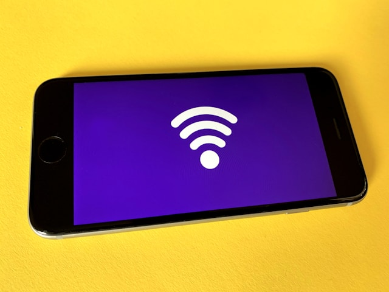

# WiFi Issues

Is your iPhone or Samsung struggling with WiFi?  
We quickly fix connection problems so you can get back online.

---

## Why Fix WiFi Problems?

- Dropped or weak signal ruins streaming, calls, and browsing
- Inconsistent or no connection can be a sign of hardware or software faults
- Ignoring issues may lead to full connectivity loss

---

## Common WiFi Problems We Solve

- Phone not connecting to WiFi at all
- Keeps disconnecting or has slow speeds
- WiFi button greyed out or won’t turn on
- Connects to some networks but not others

---

**Applies to:**  
All iPhone and Samsung Galaxy models

---

## Our WiFi Repair Process

---

**1. Diagnosis**

- Check software and settings
- Test hardware (antenna, WiFi chip, related components)

---

**2. Clear Quote**

- Honest, upfront price
- No hidden charges

---

**3. Professional Repair**

- Minor problems fixed with settings or software updates
- For hardware faults, we replace or repair WiFi chip/antenna as needed
- We only use reliable, quality parts

---

**4. Full Testing**

- Confirm strong, stable connection
- Verify all phone features work

---

**5. Fast Turnaround & Warranty**

- Most repairs done same or next day
- 90-day warranty on all parts/labor

---

## Why Fast Repair?

- **Experienced techs:** WiFi experts for iPhone & Samsung
- **Quality parts:** For lasting results
- **Transparent pricing:** No surprises
- **Warranty:** 90 days peace of mind

---

**Don’t let WiFi issues slow you down. We’ll get you reconnected fast!**

---

## Contact Us

**Phone:** +60 189621486  
**Email:** crepair276@gmail.com  
**Location:** 1st Floor, Lot No 1-001G, Plaza Low Yat, 7, Jalan Bintang, Bukit Bintang, 55100 Kuala Lumpur

_Express service available for urgent needs._
